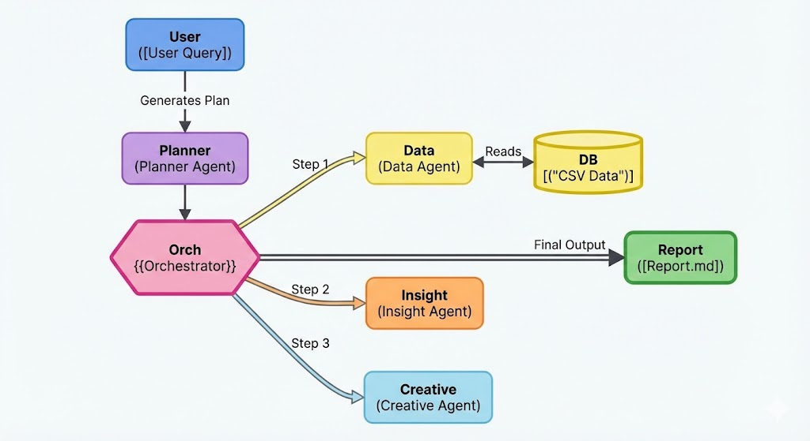

# Kasparro Agentic Facebook Analyst

## 🤖 Overview
This project implements a Multi-Agent System (MAS) that acts as an autonomous Facebook Ads Analyst. It uses a team of specialized AI agents to:
1.  **Plan** an analysis strategy.
2.  **Query** raw CSV data using Python/Pandas.
3.  **Analyze** performance trends (ROAS, CTR, Spend).
4.  **Generate** new ad creative variations to improve performance.

## 🏗 Architecture
The system follows a hierarchical flow orchestrated by `run.py`.



* **Planner Agent:** Decomposes user queries into executable steps.
* **Data Agent:** Executes Python code to extract metrics from `data/`.
* **Insight Agent:** Interprets data patterns (e.g., "Creative Fatigue").
* **Creative Agent:** Generates high-converting ad copy based on insights.

## 🚀 Quick Start

### Prerequisites
* Python 3.10+
* Google Gemini API Key (or OpenAI/Claude)

### Installation
1.  Clone the repository:
    ```bash
    git clone https://github.com/diwakar7sharma/kasparro-agentic-fb-analyst-diwakar-sharma.git
    cd kasparro-agentic-fb-analyst-diwakar-sharma
    ```

2.  Install dependencies:
    ```bash
    pip install -r requirements.txt
    ```

3.  Configure Environment:
    Create a `.env` file in the root directory:
    ```text
    GEMINI_API_KEY=your_api_key_here
    ```

### Usage
Run the main orchestrator:
```bash
python run.py